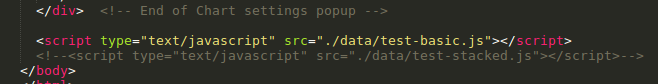
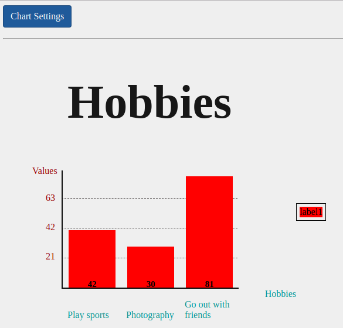
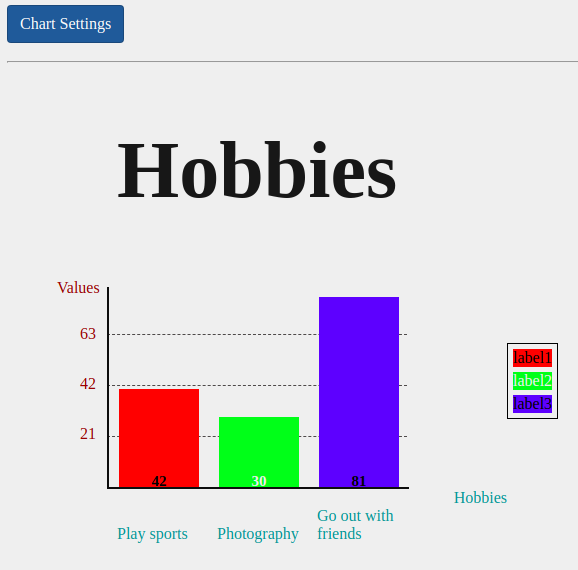
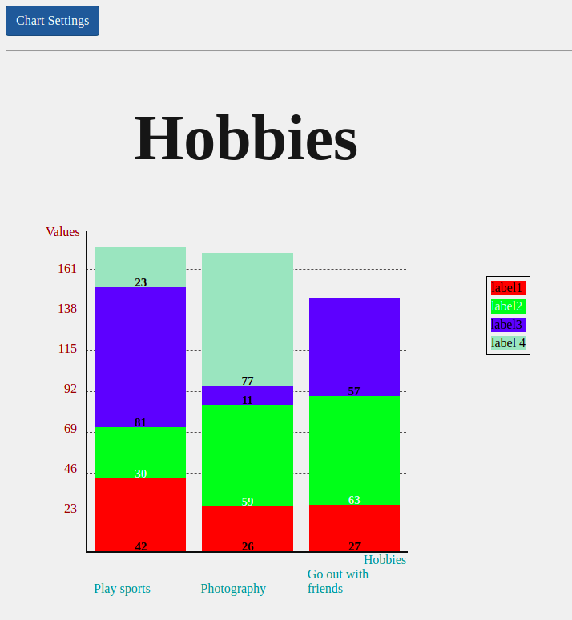
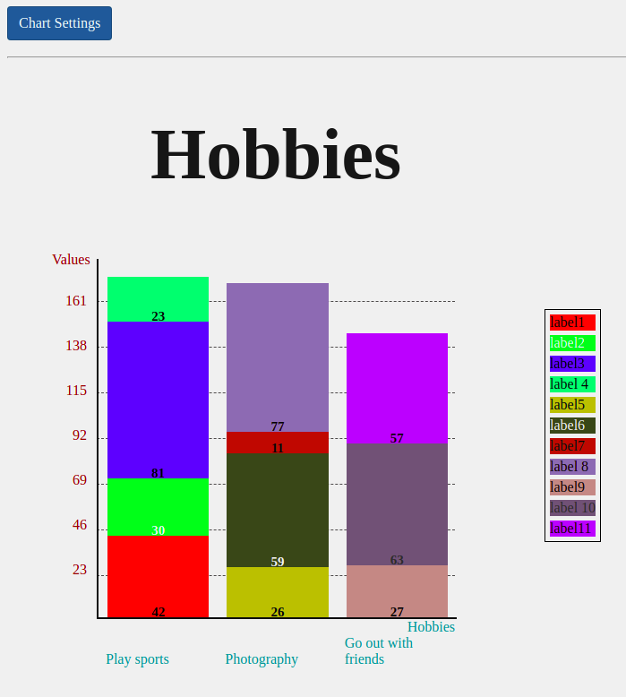
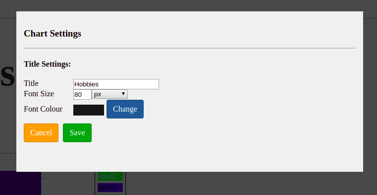
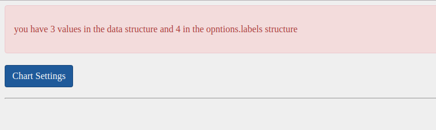

# Bar Chart

## About
A customized bar chart created using HTML, CSS and jQuery.
By inserting the **`<file>.js`** between the **`
`** and the **`</body>`** tags, as demonstrated in the image below, and by calling the function drawBarChart in the script, the bar chart is created.

### Basic bar chart

#### One colour

#### Customized colours 

### Stacked bar chart

#### One colour

#### Customized colours 

## API functions

**`function drawBarChart(data, options, element)`**

### Parameters

**data** - is a mandatory parameter
  If you want a **basic** chart, **data** must be an array, i.e. `[42, 30, 81]`.
  If you want a **stacked** chart, **data** must be an array of arrays, where the inner array will have all the values the bar must have, i.e.
    `[
        [42, 30, 81, 23]
        [26, 59, 11, 77],
        [27, 63, 57]
    ]`

**options**
  The height, width and font sizes, except the title's font size, must have 'px' as the unit of measure.
  
  **Title**
* title - type of string, default value *Chart Title*
* titleFontSize - type of string, default value *large*
* titleFontColour - type of string, default value *rgb(0, 0, 100)*

    Can be customized through the Chart Settings modal popup.

  **Bar**
* barSpacing - type of string, default value *4px*
* barFontSize - type of string, default value *15px*
* positionOfValues - type of string, default value *center*, must be *top*, *center* or *bottom*

  **General**    
* height - type of string, default value *400px*
* width - type of string, default value *400px*

  **Axis**
* xAxis - Mandatory parameter, type of object
  - name - type of string, default value *xAxis*
  - labels - type of array , default value *15px*
  - colour - type of string, default value *rgb(0, 0, 100)*
* yAxis - Mandatory paramenter, type of object
  - name - type of string, default value *yAxis*
  - colour - type of string, default value *rgb(0, 0, 100)*

  **Label**
* labels - Mandatory parameter, type of object
  - colour - type of string
  - text - type of string
  - fontSize - type of string, default value *15px*
  - labelColour - type of string, default value *rgb(0, 0, 0)*

    If you want a to **group** the values by colour, **label** must be an array with only one inner array, where the inner array must have objects, i.e.
      `[
        [
          {colour: "rgb(255, 0, 0)", text: "label1"}, 
          {colour: "rgb(0, 255, 0)", text: "label2", labelColour: "rgb(240, 240, 240)"}, 
          {colour: "rgb(0, 0, 255)", text: "label3"}, 
          {text: "label      4", fontSize: '25px'}
        ]
      ]`
    If you want a **basic** chart, you the inner array must have only one objects.
    If you want a **stacked**, the number of objects must be the same max number of values stacked in a bar.

    If you want to **customize** the value with different colours, **label** must be an array of objects, i.e.
      `[
        {colour: "rgb(255, 0, 0)", text: "label1"}, 
        {colour: "rgb(0, 255, 0)", text: "label2", 
        labelColour: "rgb(240, 240, 240)"}, 
        {colour: "rgb(0, 0, 255)", text: "label3"}, 
        {text: "label      4"}, {text: "label5"}, 
        {text: "label6", labelColour: "rgb(240, 240, 240)"}, 
        {text: "label7"},
        {text: "label      8"}, 
        {text: "label9"}, 
        {text: "label     10", labelColour: "rgb(40, 40, 40)"}, 
        {text: "label11"}
      ]`
      The number of objects must be the same number of values passed on the data parameter.

**element**
  Type of string and is the jQuery element that the chart will get rendered into.

### Errors
In case of any errors occurs, a message will be displayed, as illustrated in the image below.

## Known issues / bugs
* Negative values are not displayed in the chart
* X-axis name has a position issue

## Features
* Fix issues/bugs
* Insert more options at Chart Settings modal popup
* Let the user insert a Unit of Measure different than 'px'

## External Resources
* [API jQuery](https://api.jquery.com/)
* [ESLint](https://github.com/brackets-userland/brackets-eslint/issues/73)
* [Mozilla JavaScript](https://developer.mozilla.org/en-US/docs/Web/JavaScript/Reference)
* [W3Schools](https://www.w3schools.com/jsref)
* [Issue - object property](https://stackoverflow.com/questions/19301768/determine-if-the-object-has-a-property-and-value-in-javascript)
* [Markdown](https://guides.github.com/features/mastering-markdown/)
